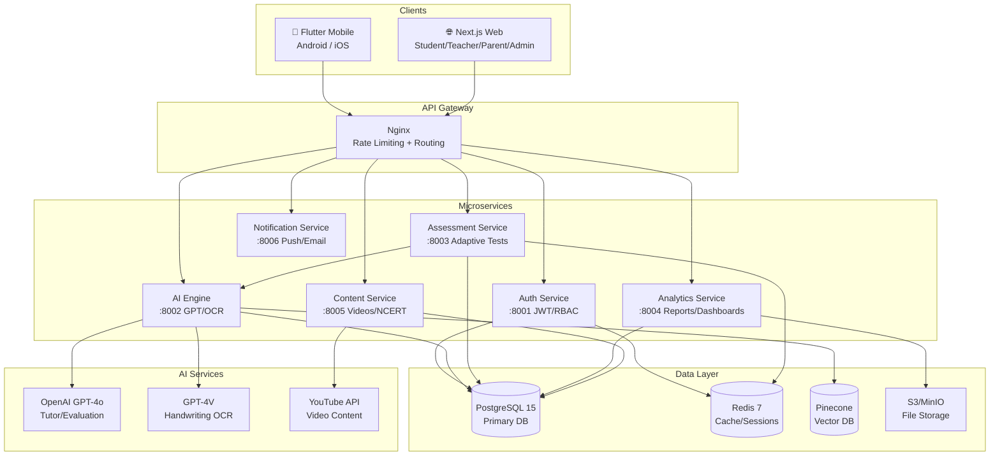
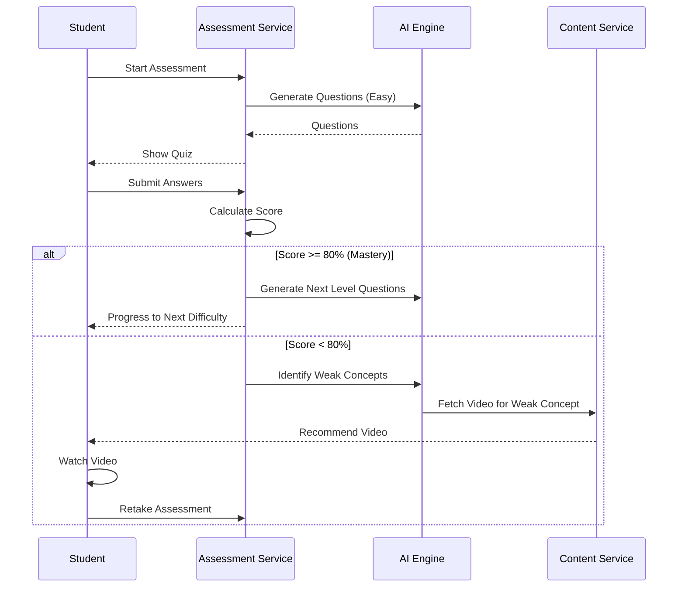
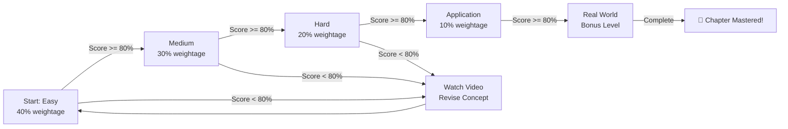
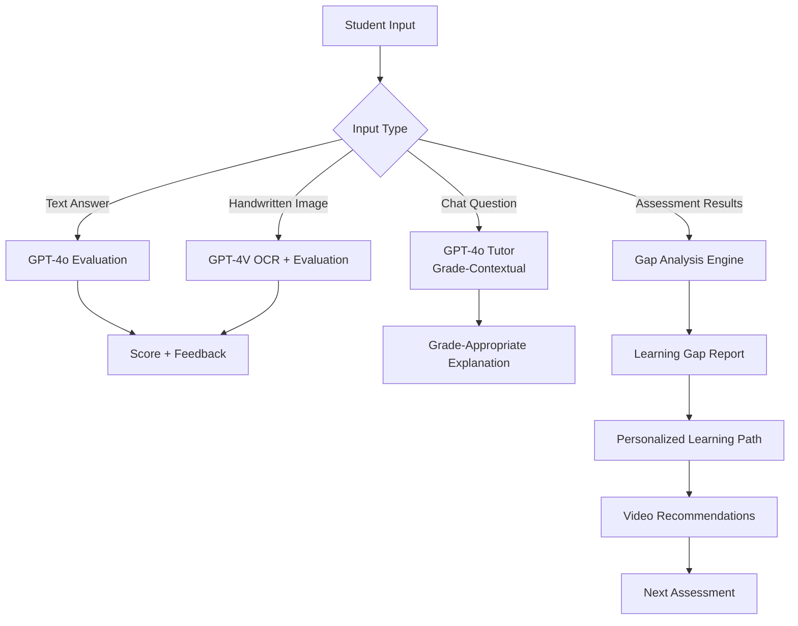
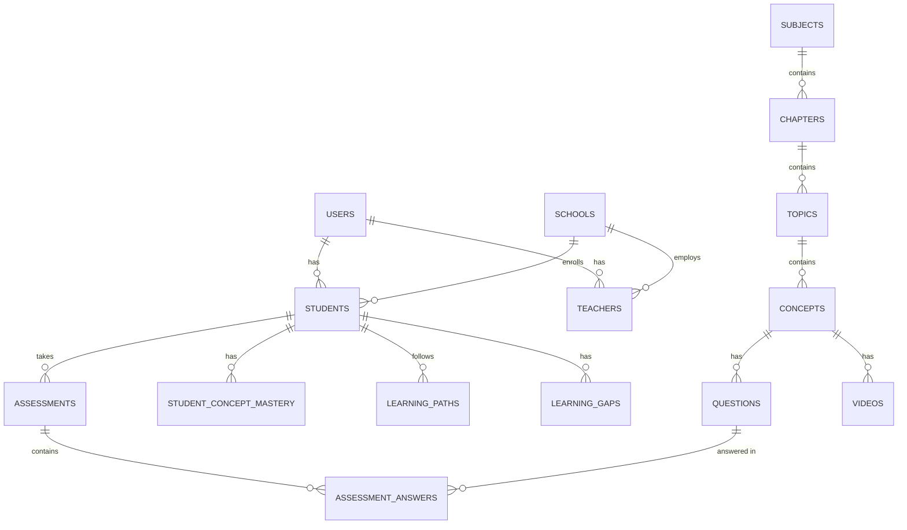
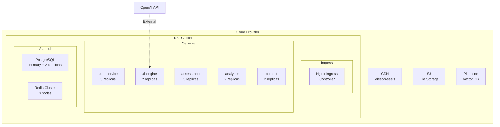
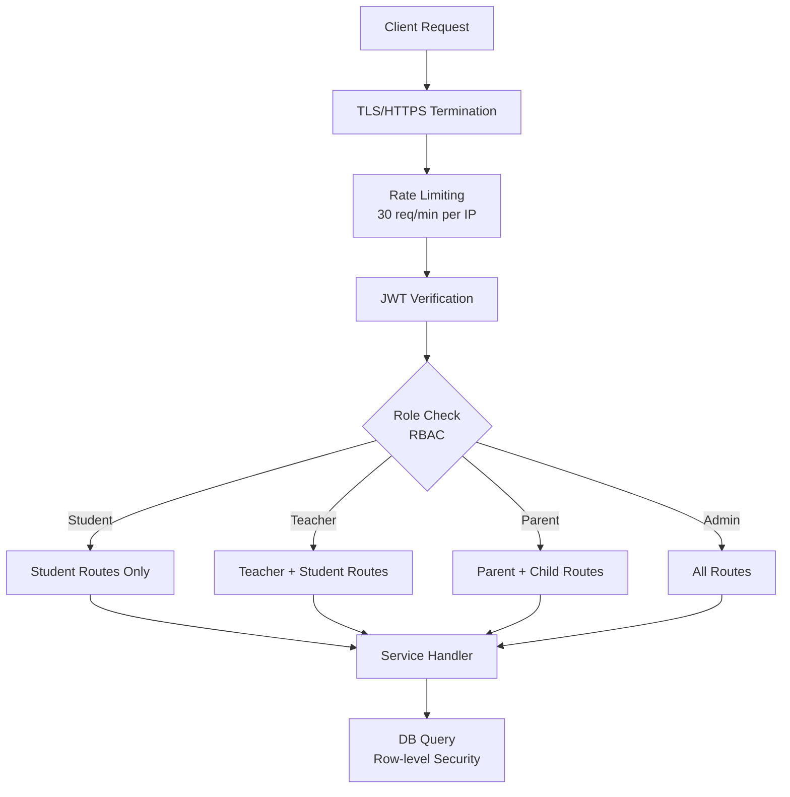

# System Architecture — AI Learning Companion

## 1. High-Level Architecture

## 2. Core Learning Loop

## 3. Adaptive Testing Engine

## 4. AI Pipeline

## 5. Database ER Diagram

## 6. Deployment Architecture (Kubernetes)

## 7. Security Architecture

## 8. Development Roadmap

| Phase | Duration | Features |
|-------|----------|----------|
| **MVP** | Month 1–3 | Auth, MCQ tests, GPT tutor, 3 subjects (Math/Science/English), basic dashboard |
| **Beta** | Month 4–6 | OCR handwriting, video engine, parent dashboard, gamification, gap analysis |
| **v1.0** | Month 7–9 | All 9 subjects, knowledge graph, PDF report cards, mobile app launch |
| **Scale** | Month 10–12 | 1M users, K8s, full analytics, SR-IOV, leaderboards, AI video generation |

## 9. Cost Estimation (Monthly at 10K Students)

| Item | Cost |
|------|------|
| Cloud Compute (K8s) | ₹15,000 |
| PostgreSQL RDS | ₹8,000 |
| Redis Cache | ₹3,000 |
| OpenAI API (GPT-4o) | ₹12,000 |
| CDN + S3 Storage | ₹4,000 |
| Firebase Notifications | ₹1,000 |
| **Total** | **~₹43,000/month** |
